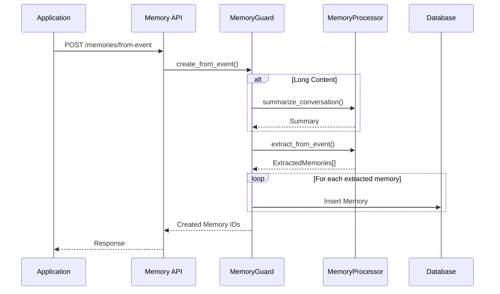

# Design Document: Event Processor Layer

## Overview

Event Processor Layer 是对现有 Memory Framework 的增强，通过扩展现有的 MemoryProcessor 来支持从原始事件（Event）提纯为结构化记忆（Memory）。

**核心理念：Event 是 Memory 创建的一种方式，不是独立的实体。**

### 简化设计

```
┌─────────────────────────────────────────────────────────────┐
│                    User Application                          │
└──────────────────────┬──────────────────────────────────────┘
                       │
                       ▼
              ┌─────────────────────┐
              │   Memory API        │
              │                     │
              │  方式1: 直接创建    │  ← 用户已经整理好的内容
              │  方式2: 事件提纯    │  ← 原始事件，需要 LLM 处理
              │  方式3: 查询增强    │  ← 自然语言查询
              └──────────┬──────────┘
                         │
                         ▼
              ┌─────────────────────┐
              │   Memory Server     │
              │   (Core Storage)    │
              └─────────────────────┘
```

### Event → Memory 流程

```
Event (原始输入)
    │
    ▼
┌─────────────────┐
│ LLM 提纯处理    │
│ • 长文本摘要    │
│ • 事实提取      │
│ • 偏好推断      │
│ • 多条拆分      │
└────────┬────────┘
         │
         ▼
Memory[] (结构化存储)
```

### Event vs Memory 概念

| 维度   | Event (输入)         | Memory (输出)        |
| ------ | -------------------- | -------------------- |
| 本质   | 原始用户行为         | 提纯后的记忆         |
| 确定性 | 100% 事实            | 90% 事实 + 10% 推断  |
| 存储   | 作为 raw_content     | 作为 content         |
| 示例   | "用户点击不喜欢按钮" | "用户不喜欢深色主题" |

## Architecture

### 扩展现有组件

不创建新的独立模块，而是扩展现有组件：

```
┌─────────────────────────────────────────────────────────────────┐
│                     Memory Server (扩展)                         │
├─────────────────────────────────────────────────────────────────┤
│                                                                  │
│  ┌──────────────────────────────────────────────────────────┐   │
│  │              MemoryProcessor (扩展)                       │   │
│  │                                                           │   │
│  │  现有功能:                    新增功能:                   │   │
│  │  • compress()                 • extract_from_event()     │   │
│  │  • classify()                 • summarize_conversation() │   │
│  │  • extract_tags()             • infer_preferences()      │   │
│  │                               • enhance_query()          │   │
│  └──────────────────────────────────────────────────────────┘   │
│                                                                  │
│  ┌──────────────────────────────────────────────────────────┐   │
│  │              MemoryGuard (扩展)                           │   │
│  │                                                           │   │
│  │  现有功能:                    新增功能:                   │   │
│  │  • create_memory()            • create_from_event()      │   │
│  │  • update_memory()            • batch_create_from_events()│   │
│  │  • retrieve()                 • retrieve_with_enhancement()│  │
│  └──────────────────────────────────────────────────────────┘   │
│                                                                  │
└──────────────────────────────────────────────────────────────────┘
```

### 处理流程



## Components and Interfaces

### 1. 扩展 MemoryProcessor

在现有 `MemoryProcessor` 基础上增加事件处理能力：

```rust
/// 推断类型（用于标记 Memory 的来源）
#[derive(Debug, Clone, Copy, Serialize, Deserialize)]
#[serde(rename_all = "snake_case")]
pub enum InferenceType {
    /// 事实：直接从事件提取
    Fact,
    /// 偏好：推断用户喜好
    Preference,
    /// 模式：识别行为模式
    Pattern,
    /// 规则：提取业务规则
    Rule,
}

/// 从事件提取的记忆
#[derive(Debug, Clone, Serialize, Deserialize)]
pub struct ExtractedMemory {
    /// 记忆内容
    pub content: String,
    /// 推断类型（LLM 自动判断）
    pub inference_type: InferenceType,
    /// 置信度 (0.0-1.0)
    pub confidence: f32,
    /// 分类（LLM 自动分类）
    pub category: MemoryCategory,
    /// 标签（LLM 自动提取）
    pub tags: Vec<String>,
    /// 重要性（LLM 自动评估）
    pub importance: f32,
    /// 推断理由
    pub reasoning: String,
}

/// 事件提取请求（不限定事件类型，让 LLM 自己理解）
#[derive(Debug, Clone)]
pub struct ExtractFromEventRequest {
    /// 事件内容（可以是任何形式：点击描述、对话记录、操作日志等）
    pub content: String,
    /// 可选上下文（帮助 LLM 更好理解）
    pub context: Option<String>,
}

/// 事件提取结果
#[derive(Debug, Clone, Serialize, Deserialize)]
pub struct ExtractFromEventResult {
    /// 事件摘要（LLM 生成的事件理解）
    pub event_summary: String,
    /// 提取出的记忆列表
    pub extracted_memories: Vec<ExtractedMemory>,
    /// 处理置信度
    pub confidence: f32,
}

impl MemoryProcessor {
    /// 从事件提取记忆（新增方法）
    /// 
    /// LLM 会自动：
    /// 1. 理解事件类型和内容
    /// 2. 提取事实和推断偏好
    /// 3. 自动分类和打标签
    /// 4. 评估重要性和置信度
    pub async fn extract_from_event(
        &self,
        request: ExtractFromEventRequest,
    ) -> Result<ExtractFromEventResult, ProcessingError> {
        // 1. 如果内容过长，先摘要
        let content = if self.needs_summary(&request.content) {
            self.summarize_conversation(&request.content).await?
        } else {
            request.content.clone()
        };
        
        // 2. 调用 LLM 提取记忆（不限定事件类型）
        let prompt = self.build_extraction_prompt(&content, &request.context);
        let response = self.llm_provider.chat(
            ChatRequest::new(prompt)
                .with_temperature(0.3)
                .with_json_response()
        ).await?;
        
        // 3. 解析结果
        Self::parse_extraction_response(&response.content)
    }
    
    /// 摘要长对话（新增方法）
    pub async fn summarize_conversation(
        &self,
        content: &str,
    ) -> Result<String, ProcessingError> {
        // 调用 LLM 进行摘要
    }
    
    /// 增强查询（新增方法）
    pub async fn enhance_query(
        &self,
        query: &str,
        context: Option<&str>,
    ) -> Result<EnhancedQuery, ProcessingError> {
        // 调用 LLM 扩展查询
    }
    
    /// 检查是否需要摘要
    fn needs_summary(&self, content: &str) -> bool {
        // 简单估算：每个字符约 0.5 token
        content.len() > 4000 // ~2000 tokens
    }
    
    /// 构建提取 prompt（不限定事件类型）
    fn build_extraction_prompt(&self, content: &str, context: &Option<String>) -> String {
        // LLM 自己理解事件类型和内容
    }
}
```

### 2. 扩展 MemoryGuard

在现有 `MemoryGuard` 基础上增加事件处理入口：

```rust
/// 从事件创建记忆的请求（不限定事件类型）
#[derive(Debug, Clone, Serialize, Deserialize)]
pub struct CreateFromEventRequest {
    /// 事件内容（任何形式的用户行为描述）
    pub content: String,
    /// 可选上下文
    pub context: Option<String>,
    /// 作用域类型
    pub scope_type: ScopeType,
    /// 作用域 ID
    pub scope_id: String,
    /// 使用场景
    pub scene: String,
    /// 处理模式
    pub mode: Option<ProcessingMode>,
}

/// 处理模式
#[derive(Debug, Clone, Copy, Default, Serialize, Deserialize)]
#[serde(rename_all = "snake_case")]
pub enum ProcessingMode {
    /// 全自动：提取并创建记忆
    Auto,
    /// 辅助模式：返回建议，等待确认（默认）
    #[default]
    Assisted,
    /// 手动模式：仅摘要，不提取
    Manual,
}

/// 从事件创建记忆的结果
#[derive(Debug, Clone, Serialize, Deserialize)]
pub struct CreateFromEventResult {
    /// 事件摘要
    pub event_summary: String,
    /// 提取出的记忆
    pub extracted_memories: Vec<ExtractedMemory>,
    /// 已创建的记忆 ID（仅 auto 模式）
    pub created_memory_ids: Option<Vec<Uuid>>,
}

impl MemoryGuard {
    /// 从事件创建记忆（新增方法）
    pub async fn create_from_event(
        &self,
        request: CreateFromEventRequest,
    ) -> Result<CreateFromEventResult, AppError> {
        let mode = request.mode.unwrap_or_default();
        
        // 1. 调用 MemoryProcessor 提取记忆
        let extract_result = self.processor.extract_from_event(
            ExtractFromEventRequest {
                content: request.content.clone(),
                context: request.context,
            }
        ).await?;
        
        // 2. 根据模式决定是否创建
        let created_ids = match mode {
            ProcessingMode::Auto => {
                // 自动创建所有提取的记忆
                let mut ids = Vec::new();
                for extracted in &extract_result.extracted_memories {
                    let memory = self.create_memory_from_extracted(
                        extracted,
                        &request,
                    ).await?;
                    ids.push(memory.id);
                }
                Some(ids)
            }
            ProcessingMode::Assisted | ProcessingMode::Manual => None,
        };
        
        Ok(CreateFromEventResult {
            event_summary: extract_result.event_summary,
            extracted_memories: extract_result.extracted_memories,
            created_memory_ids: created_ids,
        })
    }
    
    /// 增强查询并检索（新增方法）
    pub async fn retrieve_with_enhancement(
        &self,
        request: RetrieveRequest,
        enhance: bool,
    ) -> Result<RetrieveResult, AppError> {
        let query = if enhance {
            let enhanced = self.processor.enhance_query(
                &request.query,
                request.context.as_deref(),
            ).await?;
            enhanced.enhanced_query
        } else {
            request.query.clone()
        };
        
        // 使用增强后的查询进行检索
        self.retrieve(RetrieveRequest { query, ..request }).await
    }
}
```

### 3. 扩展 API 层

在现有 API 基础上增加新端点：

```rust
/// POST /api/v1/memories/from-event 请求（不限定事件类型）
#[derive(Debug, Serialize, Deserialize, ToSchema)]
pub struct CreateFromEventApiRequest {
    /// 事件内容（任何形式的用户行为描述）
    pub content: String,
    /// 可选上下文
    #[serde(default)]
    pub context: Option<String>,
    /// 处理模式
    #[serde(default)]
    pub mode: Option<ProcessingMode>,
    /// 作用域类型
    pub scope_type: ScopeType,
    /// 作用域 ID
    pub scope_id: String,
    /// 使用场景
    pub scene: String,
}

/// POST /api/v1/memories/from-event 响应
#[derive(Debug, Serialize, Deserialize, ToSchema)]
pub struct CreateFromEventApiResponse {
    pub event_summary: String,
    pub extracted_memories: Vec<ExtractedMemoryResponse>,
    pub created_memory_ids: Option<Vec<Uuid>>,
}

#[derive(Debug, Serialize, Deserialize, ToSchema)]
pub struct ExtractedMemoryResponse {
    pub content: String,
    pub inference_type: InferenceType,
    pub confidence: f32,
    pub category: MemoryCategory,
    pub tags: Vec<String>,
    pub importance: f32,
    pub reasoning: String,
}

/// POST /api/v1/memories 请求（简化，删除 process_with_llm）
/// 用户直接创建 Memory 时，自己负责所有字段
#[derive(Debug, Serialize, Deserialize, ToSchema)]
pub struct CreateMemoryApiRequest {
    pub layer: Layer,
    pub scope_type: ScopeType,
    pub scope_id: String,
    pub scene: String,
    /// 记忆内容（用户自己整理好的）
    pub content: String,
    /// 分类（用户自己指定）
    pub category: Option<MemoryCategory>,
    /// 标签（用户自己指定）
    pub tags: Option<Vec<String>>,
    /// 重要性（用户自己评估）
    pub importance: Option<f32>,
    /// 置信度
    pub confidence: Option<f32>,
    /// TTL
    pub ttl_seconds: Option<i64>,
    /// 事件来源
    pub event_source: Option<String>,
    /// 事件时间
    pub event_time: Option<DateTime<Utc>>,
    /// 嵌入提供商
    pub embedding_provider: Option<String>,
}

/// POST /api/v1/memories/retrieve 扩展
#[derive(Debug, Serialize, Deserialize, ToSchema)]
pub struct RetrieveApiRequest {
    pub query: String,
    pub scope_type: ScopeType,
    pub scope_id: String,
    #[serde(default)]
    pub scene: Option<String>,
    #[serde(default = "default_top_k")]
    pub top_k: usize,
    /// 是否启用查询增强（新增）
    #[serde(default)]
    pub enhance_query: bool,
}
```

## Data Models

### 扩展现有 Memory 表

不创建新表，只扩展现有字段：

```sql
-- 在现有 memories 表上添加字段
ALTER TABLE memories ADD COLUMN IF NOT EXISTS inference_type VARCHAR(50);
ALTER TABLE memories ADD COLUMN IF NOT EXISTS inference_confidence REAL;
ALTER TABLE memories ADD COLUMN IF NOT EXISTS inference_reasoning TEXT;

-- inference_type: 'fact', 'preference', 'pattern', 'rule', NULL(直接创建)
-- inference_confidence: 推断置信度
-- inference_reasoning: 推断理由
```

### 扩展 Memory 结构体

```rust
/// Memory entity (扩展)
pub struct Memory {
    // ... 现有字段 ...
    
    /// 推断类型（如果是从事件提取的）
    pub inference_type: Option<InferenceType>,
    /// 推断置信度
    pub inference_confidence: Option<f32>,
    /// 推断理由
    pub inference_reasoning: Option<String>,
}
```

## Correctness Properties

*A property is a characteristic or behavior that should hold true across all valid executions of a system—essentially, a formal statement about what the system should do.*

### Property 1: Event Extraction Produces Valid Memories
*For any* valid event input, the extract_from_event method SHALL return ExtractedMemory objects with all required fields (content, inference_type, confidence, category, tags).
**Validates: Requirements 2.1, 2.2, 3.1, 3.2**

### Property 2: Long Content Compression
*For any* content exceeding 4000 characters, the summarize_conversation method SHALL produce output shorter than the input while preserving key information.
**Validates: Requirements 1.2, 1.3**

### Property 3: Short Content Passthrough
*For any* content below 4000 characters, the content SHALL be processed without summarization.
**Validates: Requirements 1.6**

### Property 4: Confidence Score Validity
*For any* extracted memory, the confidence score SHALL be in range [0.0, 1.0], with inference_type="fact" having confidence >= 0.9.
**Validates: Requirements 3.3, 3.4, 3.5**

### Property 5: Multi-Memory Extraction
*For any* event containing multiple distinct insights, extract_from_event SHALL return multiple ExtractedMemory entries.
**Validates: Requirements 2.4**

### Property 6: Processing Mode - Auto Creates Memories
*For any* request with mode="auto", create_from_event SHALL return created_memory_ids with non-empty array.
**Validates: Requirements 6.2**

### Property 7: Processing Mode - Assisted Returns Proposals
*For any* request with mode="assisted", create_from_event SHALL return extracted_memories but created_memory_ids=null.
**Validates: Requirements 6.3**

### Property 8: Processing Mode - Manual Only Summarizes
*For any* request with mode="manual", create_from_event SHALL return event_summary but empty extracted_memories.
**Validates: Requirements 6.4**

### Property 9: Default Mode is Assisted
*For any* request without mode specified, the behavior SHALL match mode="assisted".
**Validates: Requirements 6.6**

### Property 10: Query Enhancement Transparency
*For any* query enhancement, the result SHALL contain both original and enhanced query.
**Validates: Requirements 4.4**

### Property 11: Query Enhancement Bypass
*For any* retrieve request with enhance_query=false, the original query SHALL be used directly.
**Validates: Requirements 4.5**

### Property 12: Inference Traceability
*For any* memory created from event, the inference_type, inference_confidence, and inference_reasoning fields SHALL be populated.
**Validates: Requirements 7.1**

## Error Handling

### 错误类型

复用现有 `ProcessingError`，增加新的错误变体：

```rust
#[derive(Debug, Error)]
pub enum ProcessingError {
    // ... 现有错误 ...
    
    /// 事件内容过短
    #[error("Event content too short: minimum {min} characters required")]
    EventContentTooShort { min: usize },
    
    /// 无法提取有效记忆
    #[error("No valid memories could be extracted from event")]
    NoMemoriesExtracted,
    
    /// 查询增强失败
    #[error("Query enhancement failed: {0}")]
    QueryEnhancementFailed(String),
}
```

### 错误处理策略

| 错误类型 | 处理策略       | 用户反馈       |
| -------- | -------------- | -------------- |
| LLM 超时 | 重试 3 次      | 返回原始内容   |
| 内容过短 | 拒绝处理       | 提示最小长度   |
| 无法提取 | 返回空结果     | 提示无有效内容 |
| 增强失败 | 降级到原始查询 | 使用原始查询   |

## Testing Strategy

### 单元测试

- MemoryProcessor.extract_from_event: 测试事件提取逻辑
- MemoryProcessor.summarize_conversation: 测试摘要功能
- MemoryProcessor.enhance_query: 测试查询增强
- MemoryGuard.create_from_event: 测试不同模式的行为

### 属性测试

使用 `proptest` 进行属性测试：

```rust
// Property 4: Confidence Score Validity
proptest! {
    #[test]
    fn test_confidence_score_validity(
        content in "\\PC{10,100}",
    ) {
        let result = processor.extract_from_event(...).await;
        for memory in result.extracted_memories {
            prop_assert!(memory.confidence >= 0.0 && memory.confidence <= 1.0);
            if memory.inference_type == InferenceType::Fact {
                prop_assert!(memory.confidence >= 0.9);
            }
        }
    }
}
```

### 集成测试

- 端到端事件处理流程
- 不同处理模式的行为验证
- 查询增强与检索集成
